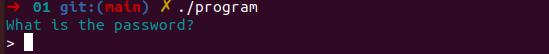
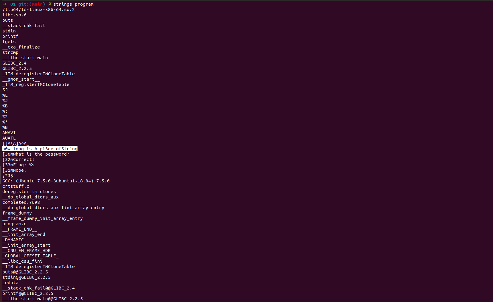
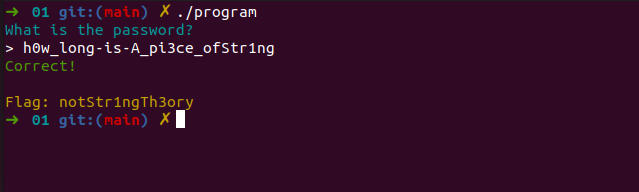



## Binary 01

> Download the file at https://cgames-files.allyourbases.co/be01.zip and
> then find a way to get the flag.

Ao baixar o arquivo zip, encontrei um arquivo "*program*", previamente já sabia que era um binário (ah vá)..

E por tradição...na primeira análise o mais adequado é analisar as strings:

Em um primeiro momento os olhos brilharam quando apareceu essa string:

    strings program

> h0w_long-is-A_pi3ce_ofStr1ng

Porém..a flag não foi aceita...então sabemos que ela seria formatada de alguma forma ou modificada, precisamos continuar a análise e executar o binário.

O programa pediu a senha, previamente vimos que tinhamos uma string interessante...minha primeira tentativa foi com ela..

E lá estava..não necessitou ferramentas adicionais para debug. 

