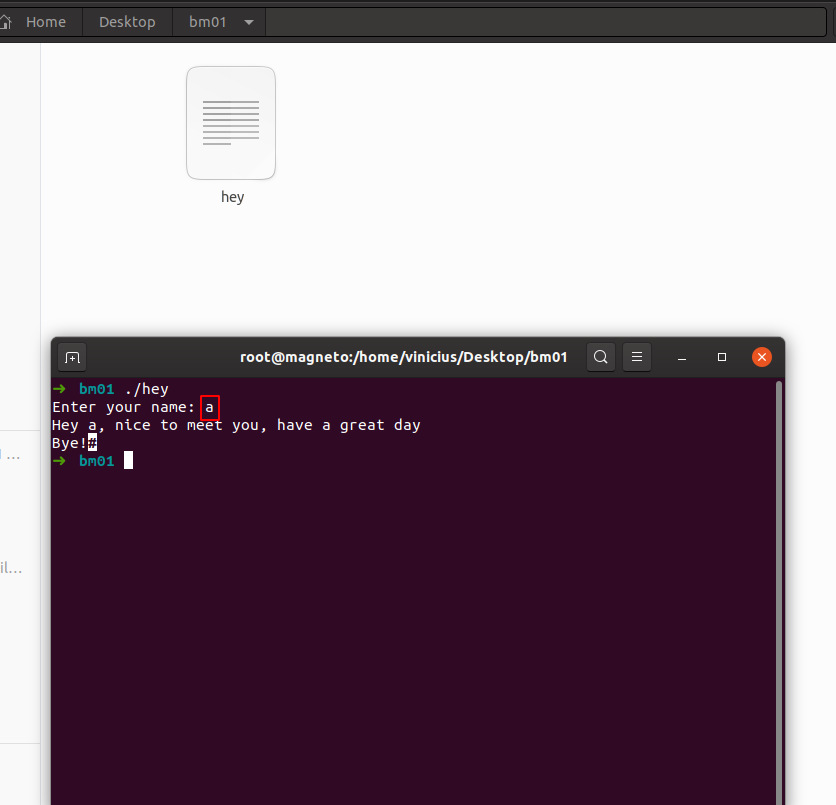
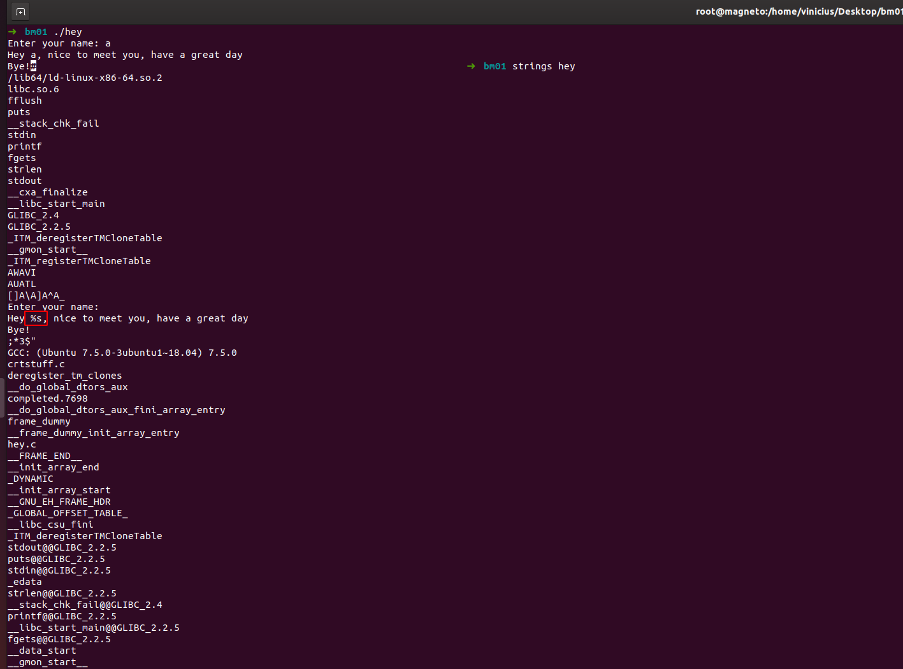
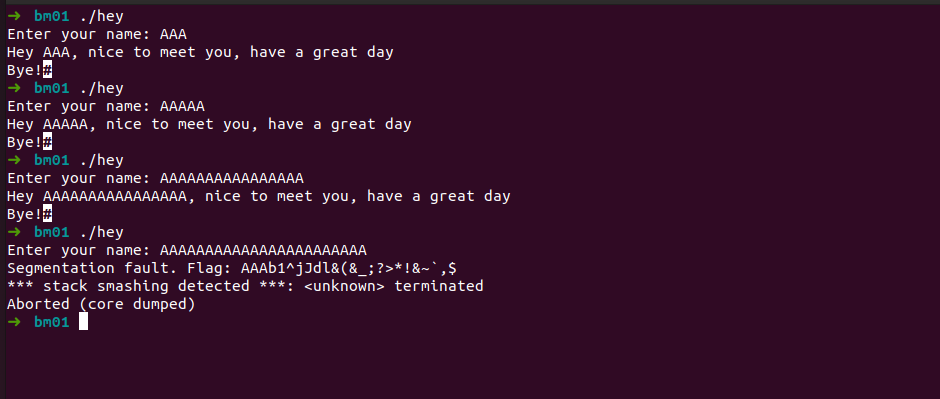



## Binary 02

> "We have a binary at https://cgames-files.allyourbases.co/bm01.zip
> which appears to do little more than ask for your name and give back a
> friendly message. What do you think, is there more to it than first
> appears?"

Na segunda flag, temos um binário chamado *hey*.. uma função a princípio que parece bem básica, ele espera o input e apresenta o output..

Nesse caso como se trata de um binário, é comum em CTF termos que explorar buffer overflow...

Então achei necessário brincar com a quantidade de caracteres suportados:

E encontramos uma quantidade máxima de caracteres..e a nossa flag. :D

