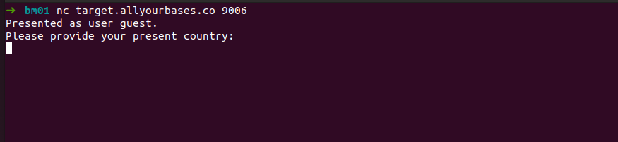
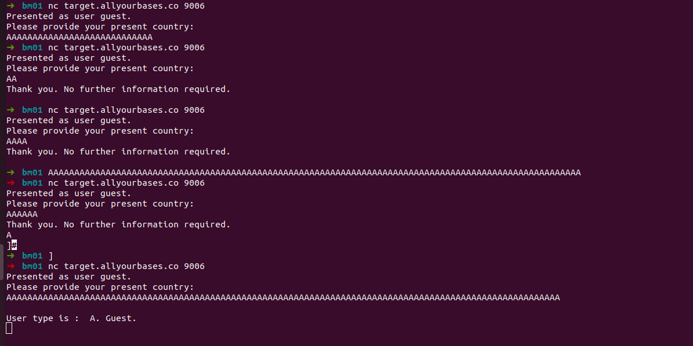
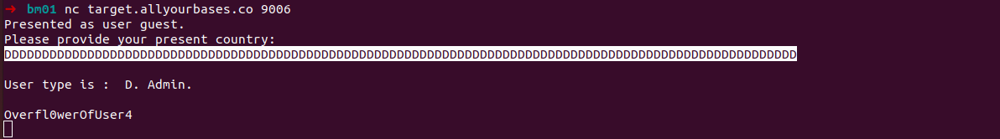



## Bonus 06

> The network service at target.allyourbases.co on port 9006 can be
> attacked. We know this from a recent scan by a security tester. There
> is a way to trigger an overwrite which causes the user type to be
> recognised as 'D' or an administrator. You will need to find the
> overflow and control the user type.

Mais um serviço para explorarmos...vamos lá.

Se trata de mais um challenge de buffer, vamos tentar algumas strings...(geralmente eu uso o A como caractere)

AAAAAAAAAAAAAAAAAAAAAAAAAAAAAAAAAAAAAAAAAAAAAAAAAAAAAAAAAAAAAAAAAAAAAAAAAAAAAAAAAAAAAAAAAAAAAAAAAAAAAAAAAAA

Conseguimos um output interessante...

Em CTF é importante reler e reler o enunciado...

Voltando ao enunciado, ele informa que é possível fazer um trigger com a letra D.

    DDDDDDDDDDDDDDDDDDDDDDDDDDDDDDDDDDDDDDDDDDDDDDDDDDDDDDDDDDDDDDDDDDDDDDDDDDDDDDDDDDDDDDDDDDDDDDDDDDDDDDDDD

e voilá...

