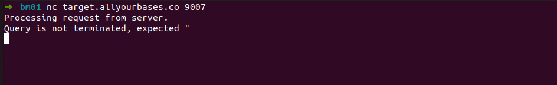
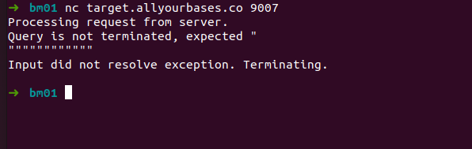
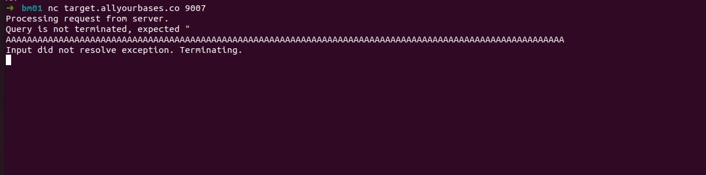
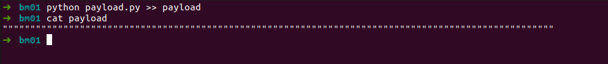
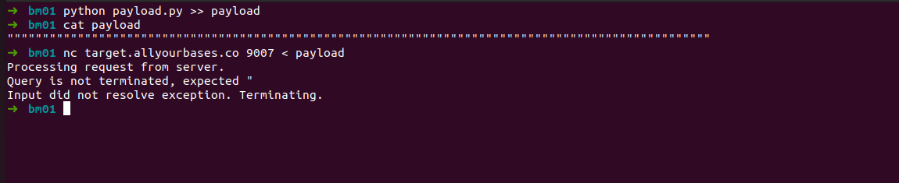



## Bonus 07

> "The network service at target.allyourbases.co on port 9007 can be
> attacked. This is similar to another service this developer built, but
> they learned their lessons and worked on securing the service.
> Security scans tell us there is still an overflow condition but this
> will be much more difficult."

Essa flag valia 1000 pontos...mais um serviço para conectarmos

    nc target.allyourbases.co 9007

here we go

O programa era parecido com um outro challenge anterior, ele esperava por input do usuário, porém não fazia output da nossa string... então era necessário fazer barulho, tentar gerar alguma exceção...e lá vamos nos..

Agora conseguimos uma mensagem diferente... parece que estamos perto...

talvez se aumentarmos o tamanho do payload..ou..até que não notei a mensagem: 

    'Query is not terminated, expected " '

Ele espera uma aspas duplas, mas talvez com um payload grande... então podemos usar o python para nos fornecer o payload, criamos um código simples para gerar um payload de 100 aspas duplas..

    #!/usr/bin/python
    print '"' * 100

E executamos e salvamos o output em um arquivo chamado payload.

    python payload.py >> payload

E tentamos enviar para a conexão:

Ainda nada, precisamos talvez aumentar o tamanho para estourar o buffer, trocamos 100 para 1000

    #!/usr/bin/python
    print '"' * 1000

Jogamos o output para o arquivo para enviar via nc

    python payload.py >> payload

E voila... 

