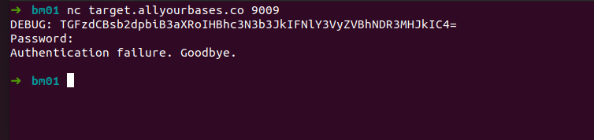
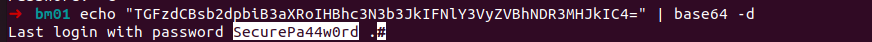
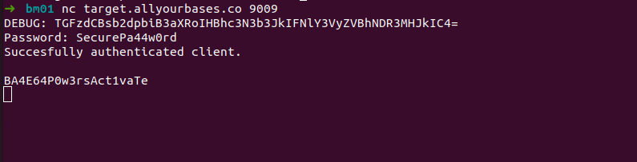


## Bonus 09

> "The network service at target.allyourbases.co on port 9009 asks the user to authenticate. Some debug information has been leaked which looks useful. It uses some common encoding and you can use a tool to recover it"

Vamos usar o *nc* para fazer conexão na porta:

    nc target.allyourbases.co 9009

O banner nos traz a informação que nós queríamos, a mensagem de DEBUG. 

Já conseguimos saber de cara que parece um Base64

Vamos fazer o decode:
 

e autenticar

