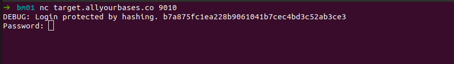
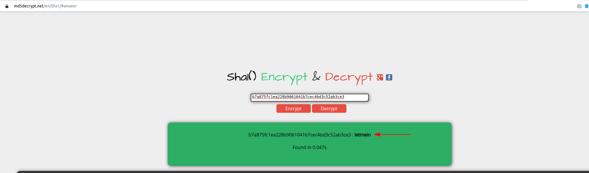
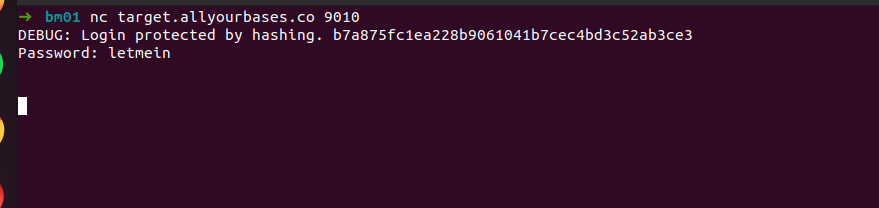
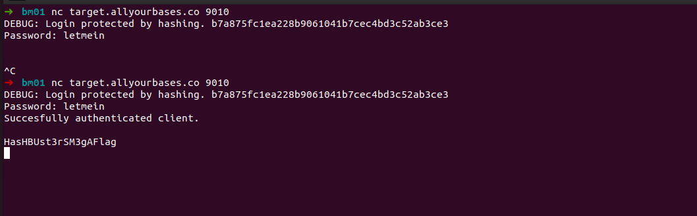



## Bonus 10

> The network service at target.allyourbases.co on port 9010 asks the
> user to authenticate. Some debug information has been leaked which
> looks useful. The data ir returns is some form of hashed password.
> Don't overthink it and you can find the password to break in to this
> service!

Esse challenge é bem específico...*não pense muito*.. vamos então conectar ao serviço..

Ao conectar recebemos um banner com um hash.. de olho parece ser um *SHA*..

É hora de utilizar bases de hashes conhecidas...resolvi utilizar o https://md5decrypt.net/en/Sha1/#answer

    b7a875fc1ea228b9061041b7cec4bd3c52ab3ce3 : letmein

obtemos a chave..agora vamos autenticar..

Demorando..deve ter algum delay server side..resolvi desconectar e reconectar..

E funcionou. <:

