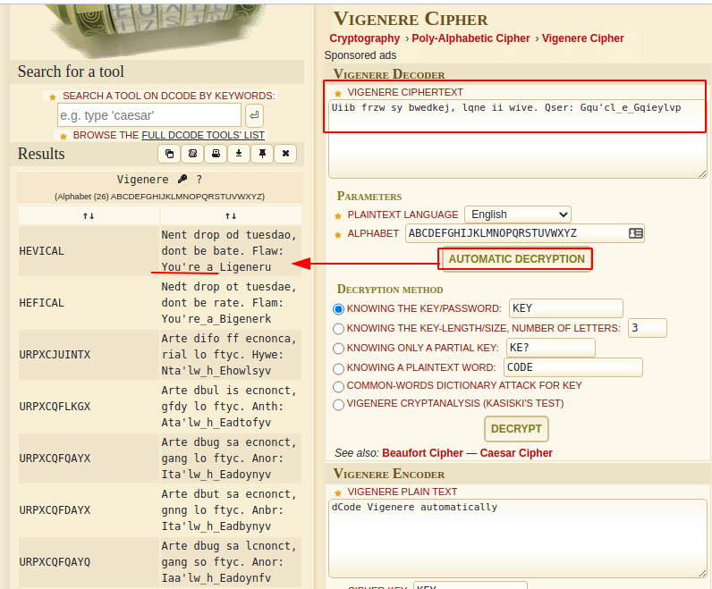
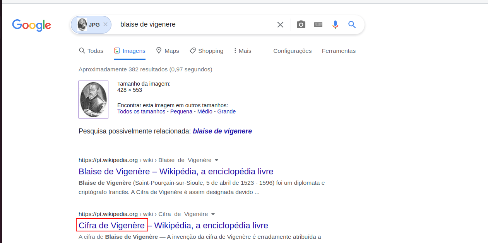



## Crypto 03

> Take a look at this cipher text, We believe that they are using an old
> method but not sure exactly which they are using. See if you can work
> out what this message is. 'Uiib frzw sy bwedkej, lqne ii wive. Qser:
> Gqu'cl_e_Gqieylvp'

Nesse challenge de crypto a flag está encriptada...porém com o enunciado você consegue saber previamente:

- É um texto cifrado...método antigo...

- O texto cifrado parece ter apenas deslocamentos de caracteres...

- E imagem só entrega o tipo de criptografia...
- 

Descobrimos que a cifra é de *vigenere*

Resolvi utilizar o decodificador do site para automatizar (não reinvente a roda):

    https://www.dcode.fr/vigenere-cipher

Apenas colei e pela primeira tentativa resolvi deixar a ferramenta testar de forma automática..

O resultado foi interessante, ele decifrou parte da string...

    "Nent drop od tuesdao, dont be bate. Flaw: You're_a_Ligeneru"

Esse trecho foi o que me chamou atenção:

    "Flaw: You're_a_"

Eu sabia que estava perto...

Não quis perder tempo tentando achar a chave...apesar de que essa ferramenta poderia me auxiliar..pois ela possibilita trabalhar apenas com parte da chave..

A intuição é importante em CTFs...

    You're_a_Vigeneru
    You're_a_Vigenere

