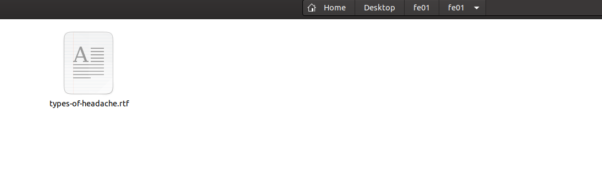
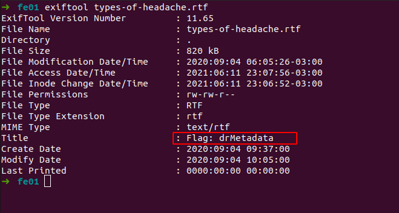



## Forensic 01

> "We've found a document at
> https://cgames-files.allyourbases.co/fe01.zip from a doctor who seems
> to be hinting at something - can you figure out where to look for the
> flag?"

Após descompactar o arquivo vi que se tratava de um *rtf*. 

Dentro do arquivo havia um meme. Nada mais, nenhum texto oculto, então os próximos passos seriam:

 - Analisar os metadados do arquivo
 - Analisar os metadados dos arquivos dentro do rtf. :D

Para analisar os metadados utilizo o exiftool.

    exiftool types-of-headache.rtf

E lá estava. 

