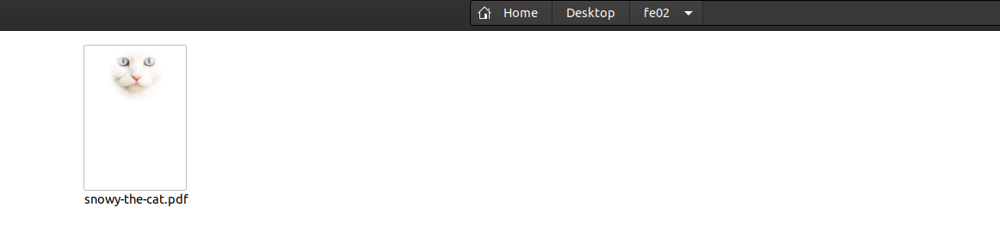
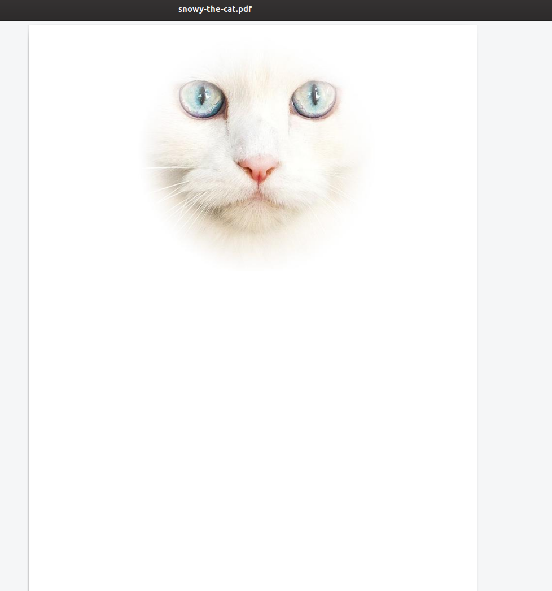

## Forensic 02

> "Our much loved cat Snowy is missing and we've had a graphic design
> company produce a poster at
> https://cgames-files.allyourbases.co/fe02.zip. We just can't see any
> details, but the graphics company said they've put all info into the
> design. Can you find the info? The flag is the phone number."

Esse aqui seria mais fácil...um PDF, não teria muitos locais onde esconder uma flag. 

Desta vez comecei pelos metadados...mas nada constava.

Então bastava abrir o arquivo..mas só teríamos a foto do gato... então ainda seria possível que o PDF contivesse texto oculto...e lá estava.

O número de telefone estava com texto de cor branca (telefone).
