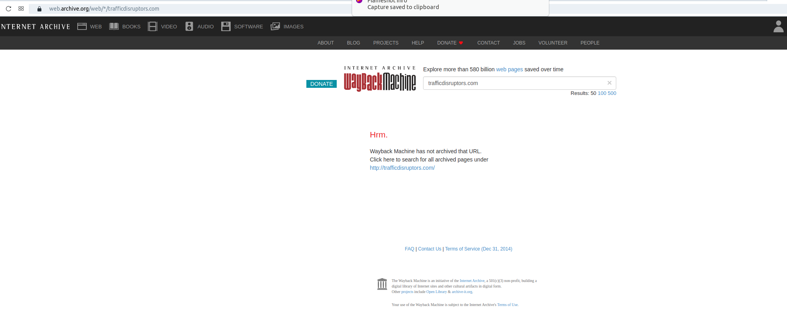

## Forensics 04

> "The domain trafficdisruptors.com has been identified as a domain
> that's used to pass information around between hackers. There appears
> to be no website there however, can you find how they're
> communicating?"

Os lugares mais mais clássicos para esconder uma flag de um site que não existe seria:

- Analisar o cache do website (ex: google), ou caso ele tenha existido algum dia e que por sorte estaria salvo em `https://web.archive.org/web/*/trafficdisruptors.com`

- Registros TXT do domínio
Para verificarmos, via linha de comando, usando o comando DIG:

    dig txt trafficdisruptors.com

