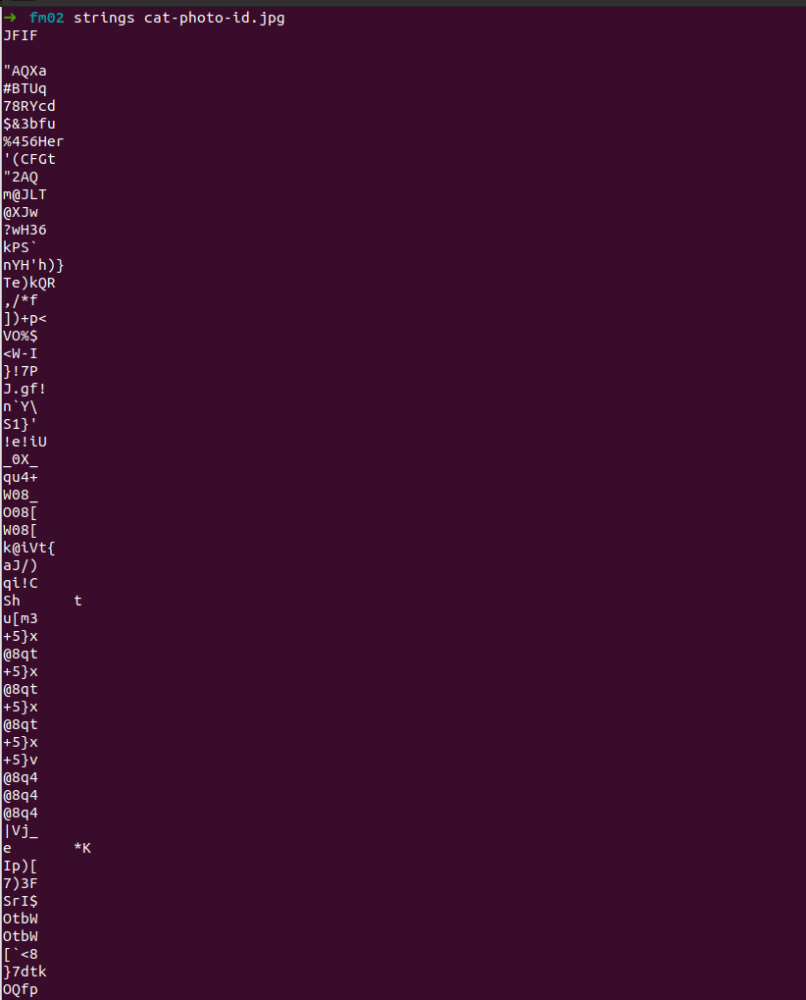

## Forensics 05

> "Something has gone wrong with the police departments modern new photo
> ID system. Here we've got a photo ID of our latest suspect
> https://cgames-files.allyourbases.co/fm02.zip but the ID appears to
> have vanished, can you find it?"

Mais uma vez, foto de gatinho.

A Flag estaria em algum lugar da imagem, primeiro teste foi com o comando do *exiftool*, seria pouco provável nessa etapa ainda repetirem a mesma técnica, mas eu precisava descartar..

Não foi o caso.

O próximo passo seria analisar possíveis injeções dentro do arquivo...utilizei o comando strings

nada encontrado...

O próximo passo seria analisar a imagem a fundo, talvez ela estivesse oculta dentro de uma cor diferente, em negativo...não sabemos.

Utilizei a ferramenta online:

    https://29a.ch/photo-forensics/
    

A flag não estaria dentro do quadrado.. se não a imagem acusaria, no caso ela não estaria totalmente preta.

Pensei que poderia ser algum outro tipo de esteganografia... mas tentei abrir usando o Photoshop, para analisar se eu teria alguma coisa dentro do arquivo que não vi...

Resolvi usar a versão online: 

    https://www.photopea.com

Ao abrir notei que haviam duas camadas...uma delas oculta..bingo.

