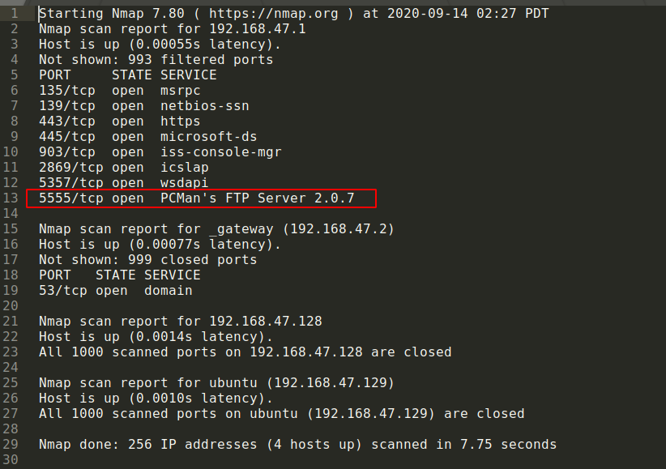
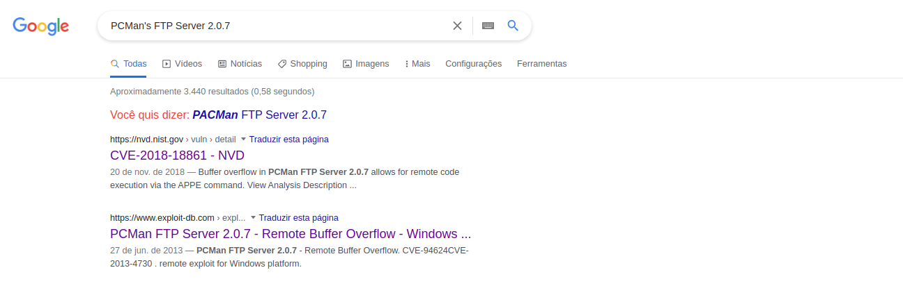


## Network 01

> We have run a nmap scan on our local network and believe there may be
> a vulnerable service. See if you can identify any services that might
> have a CVE attached to them:
> https://cgames-files.allyourbases.co/ne01.zip

Nesse desafio era necessário encontrar a flag que seria uma *CVE*... 

Ao analisar o arquivo o único serviço que mais chamava atenção seria o

    5555/tcp open  PCMan's FTP Server 2.0.7

Uma pesquisa rápida pelo serviço encontramos duas CVEs

    CVE-2018-18861
    
    CVE-2013-4730

E lá estava.

