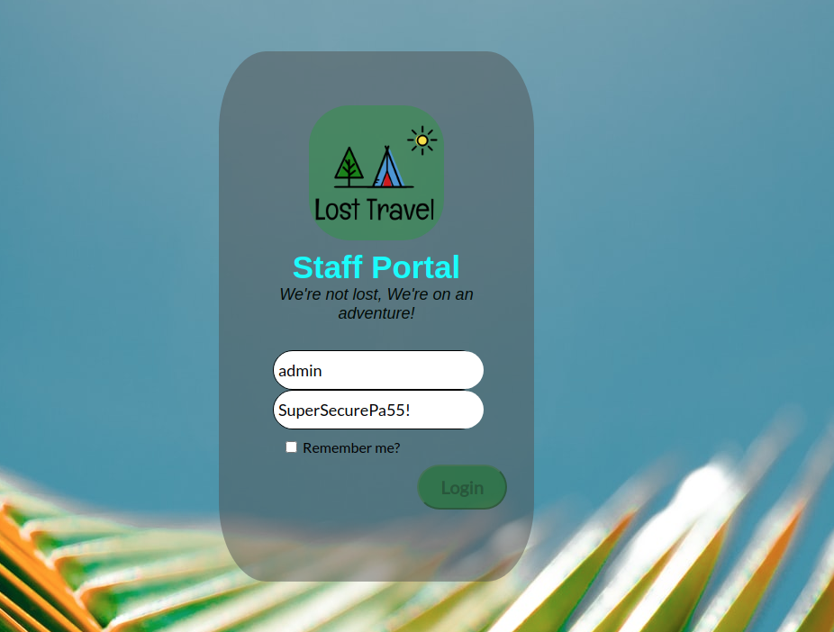
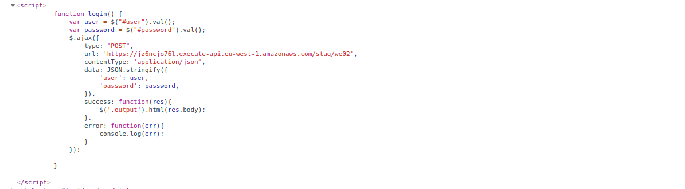
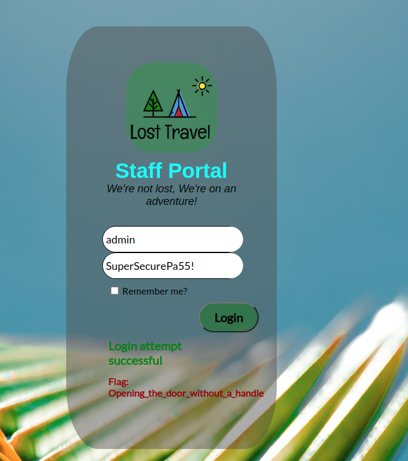


## Web 02

> "We have managed to get the login details for the staff portal at Lost
> Travel: We've come across a page from a book at
> https://cgames-we02.allyourbases.co where we believe there's extra
> information hidden., however we still cant seem to get in. Take a look
> and see if you can find a way in."

Nesta flag a primeira coisa que nos deparamos foi o campo de senha preenchido automático, mas a unica coisa que impedia de fazer o login era o botão *disabled* e o *return false*.

Inspecionando a página podíamos ver que o botão acionaria uma requisição POST, era lá que pegaríamos a nossa flag.

O jeito mais fácil, não seria usar um *Postman* ou um *BurpSuite*, bastava apenas ativarmos o botão removendo o atributo *disabled*.

