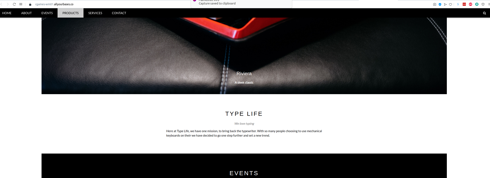
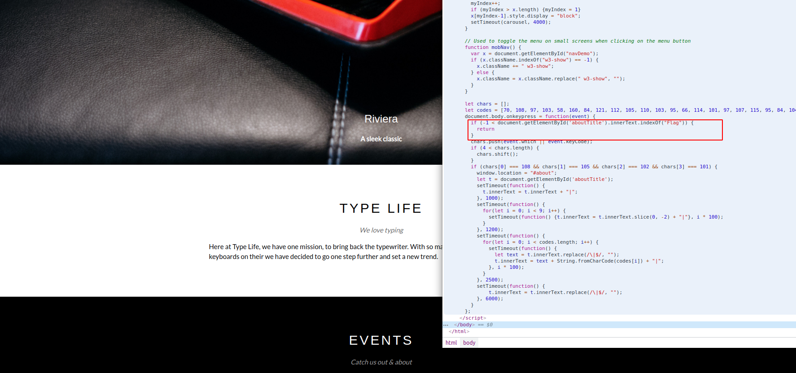
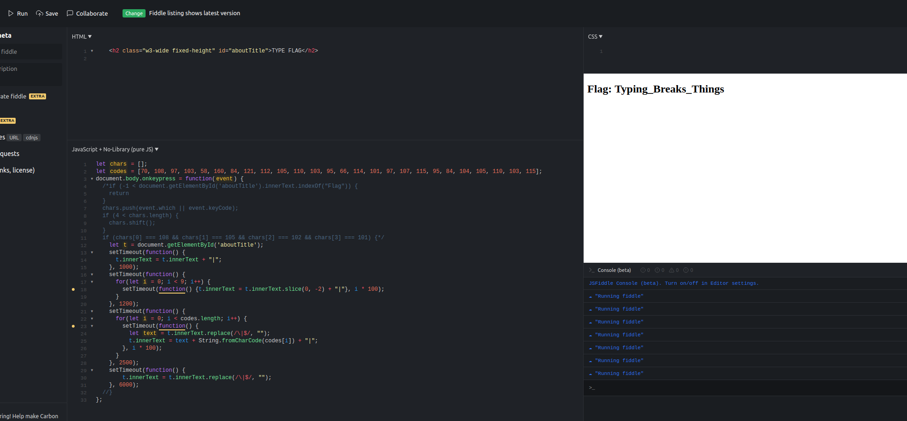



## Web 05

> "We've come across a website for typewriter lovers at
> https://cgames-wm01.allyourbases.co - but it seems to do something
> more than display these mechanical marvels, can you figure out what's
> hidden?"

Ao acessar a página parecia um website normal. De primeiro momento não pareceria fácil de encontrar a flag.

Até encontrar um trecho interessante em javascript.

Para debugar javascript eu prefiro utilizar o 

    jsfiddle.net

Copiei o trecho de código para o jsfiddle e também uma parte do html (onde seria o possível output do código javascript)

Analisando de cara eu vi que ele validava as teclas pressionadas, fazia todo sentido também o site ser sobre "TYPE WRITING"..

Comentei as validações que verificavam o input das teclas e invertiam o código.

RUN, acionei qualquer tecla e voila

