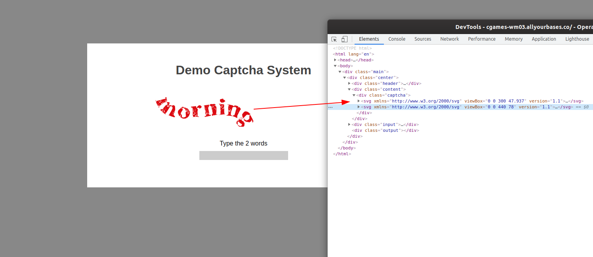
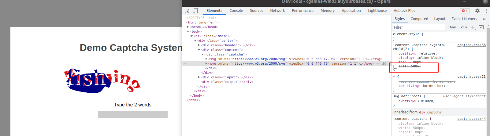
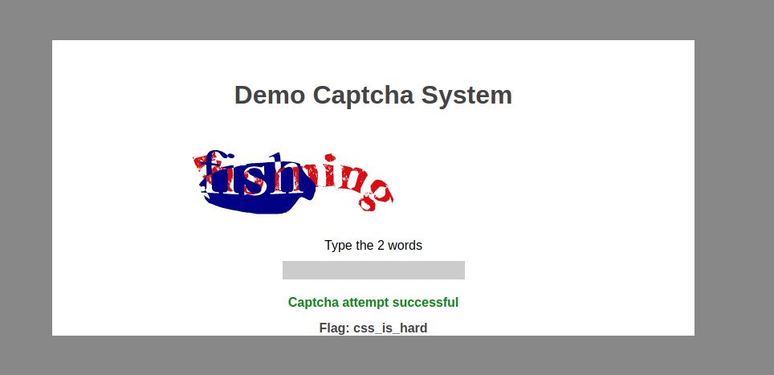


## Web 07

> "Our developer has been creating their own captcha system. We informed
> them it was a bad idea and surprise surprise they're running into
> issues with it. Have a look at https://cgames-wm03.allyourbases.co and
> see if you can solve the captcha and indeed what's wrong with what
> they've built!"

Para conquistar a flag era necessário resolver o captcha...a mensagem dizia, "*Type the 2 words*"..

Inspecionando o código foi possível ver que se tratava de 2 imagens em svg. 

A única coisa que impossibilitava a visualização era o CSS.

